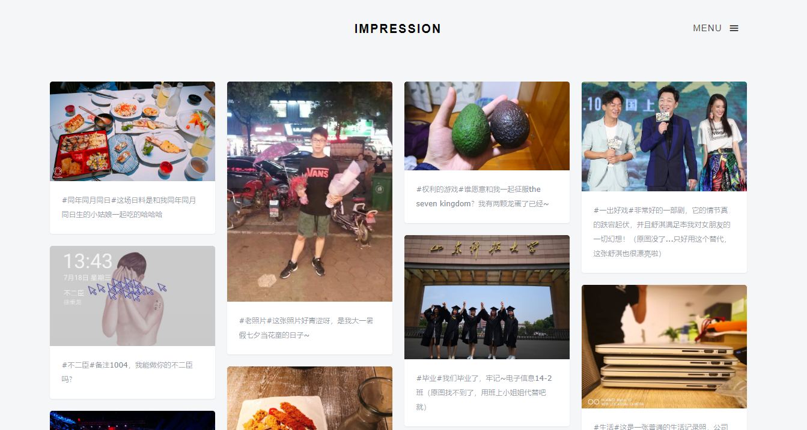
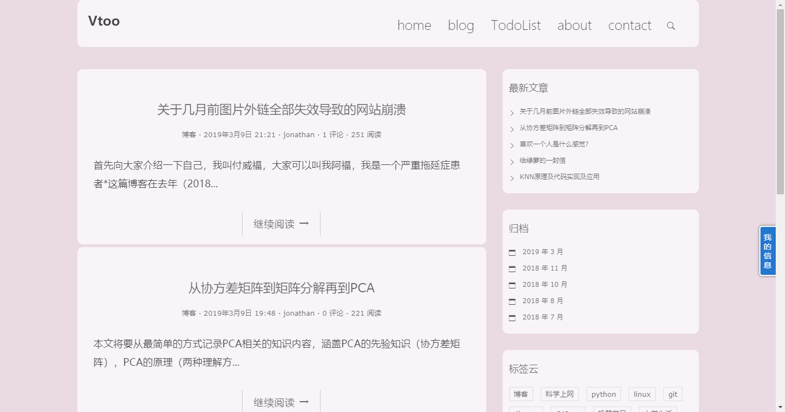
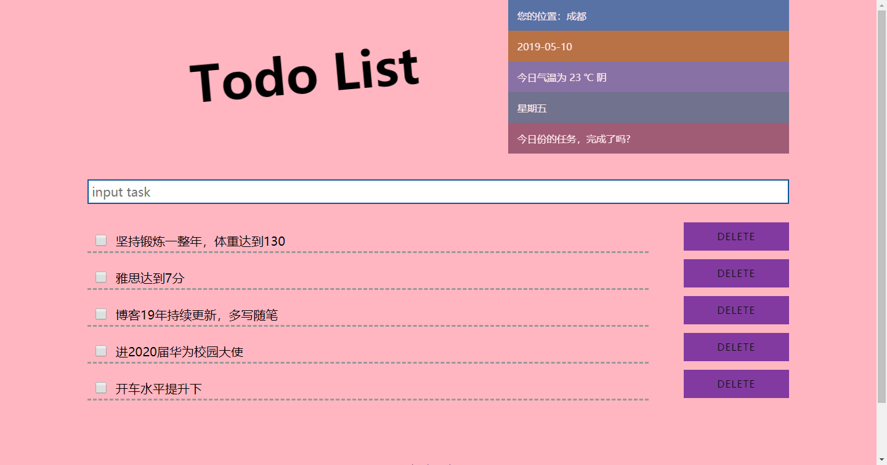
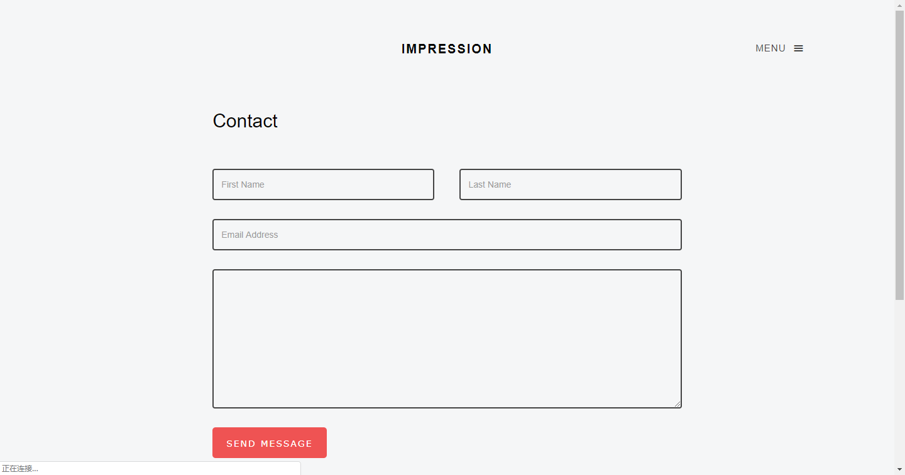
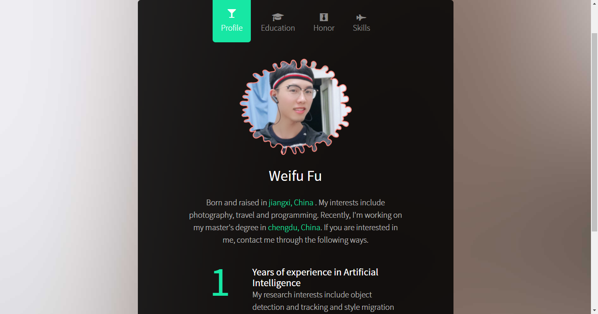

# blogproject

> 博客还在运营中~

### 网址 ： [www.vtoo.pro](www.vtoo.pro)

这是一个基于 **python3.5** 和 **Django** 的博客框架，python 作为语言，Django 作为一个 Web 框架，数据库使用 Django 自带数据库。

### 搭建博客详细教程：[追梦人物的博客](https://www.zmrenwu.com/courses/django-blog-tutorial/)

## 博客贴图

### home页面

### blog页面

### todolist页面

### contact页面

### profile页面

## 不该说的话

> 最后吐槽，想要坚持做博客真的很难，因为看的人超级少（排除一些大牛博客），运营起来也费劲，并且图片外链老是失效我能怎么办？自己也不是专门做网站的，希望未来能找到一个坚持下去的动力。

